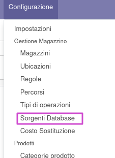
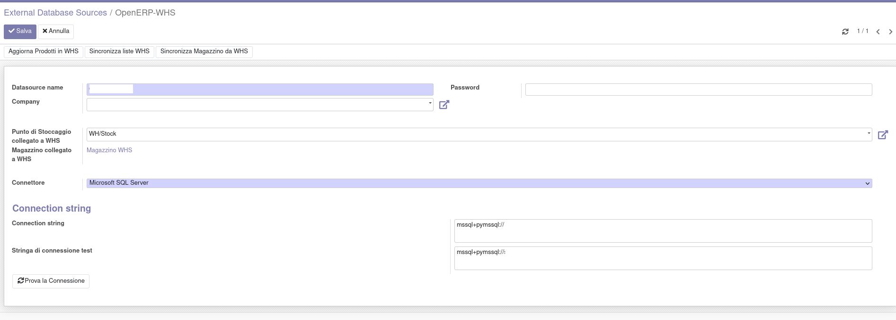
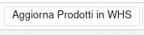
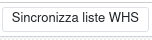
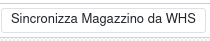
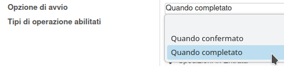
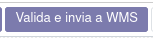

La connessione con il database del software del magazzino viene configurata nelle sorgenti database:

In questa maschera vanno indicati i dati per la connessione con la stringa e l'eventuale stringa per la connessione al database di test, il magazzino collegato e altri:

Dalla sorgente dati sono disponibile alcune azioni. La seguente va a caricare nella tabella di scambio i prodotti modificati dall'ultima esecuzione, che verranno prelevati e aggiornati nel software collegato:

Questa azione forza l'aggiornamento delle liste:

Quest'ultima l'inventario dei prodotti:

Nella sorgente dati è necessario configurare quali tipi di movimento sono gestiti tramite il WMS. In caso di configurazione tramite 2 step, vanno solitamente esclusi i trasferimenti dalle posizioni di Output e Input, per evitare un doppio scarico/carico dal WMS.

È possibile decidere se i movimenti vengono creati ed inviati al WMS con due modalità:

#. immediatamente quando il trasferimento è confermato: con questa opzione Odoo viene aggiornato in base ai movimenti eseguiti nella macchina WMS collegata;
#. a posteriori quando il trasferimento è completato: con questa opzione i trasferimenti vengono eseguiti in Odoo come di norma e vengono inviati da eseguire come già deciso. Nel caso di una esecuzione con quantità diversa il sistema aggiornerà il magazzino con una rettifica di inventario, per cui la giacenza a magazzino sarà corretta ma movimentata in maniera diversa. In particolare, se ad esempio c'è una consegna di 5 pezzi e la consegna effettiva è di 4 pezzi, la consegna in Odoo resterà come previsto e ci sarà una rettifica di magazzino in aumento di 1 pezzo.

Normalmente le liste al WMS sono inviate e lette per la sincronizzazione tramite un'azione programmata, è comunque possibile anche il solo invio immediatamente, poi la sincronizzazione procederà comunque come al solito:

Nelle righe dei trasferimenti è presente questa icona per accedere alle liste del WMS, visibile solo se ci sono:

