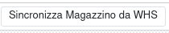

La connessione con il database del software del magazzino viene configurata nelle sorgenti database:

In questa maschera vanno indicati i dati per la connessione con la stringa e l'eventuale stringa per la connessione al database di test, il magazzino collegato e altri:

Dalla sorgente dati sono disponibile alcune azioni. La seguente va a caricare nella tabella di scambio HOST_ARTICOLI i prodotti modificati dall'ultima esecuzione, che verranno prelevati e aggiornati nel software collegato:

Questa azione forza l'aggiornamento delle liste:

Quest'ultima l'inventario dei prodotti:

