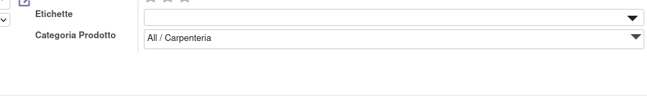
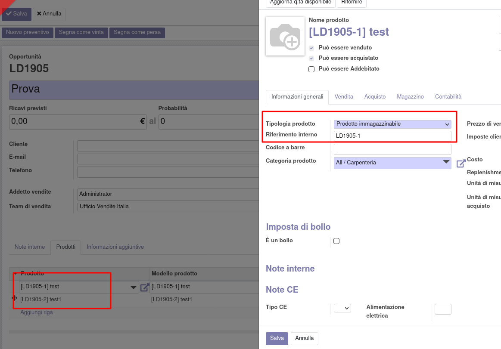

Nel lead è disponibile un campo per configurare la categoria dei prodotti creati dalle righe del lead. Questo campo può essere configurato con un predefinito con la funzione di default.

Il prodotto creato dalle righe prodotto avrà di default la categoria indicata nel lead e il riferimento interno pari al codice del lead seguito da un segno - e la sequenza della riga. Inoltre avrà di default il tipo 'prodotto stoccabile'.

