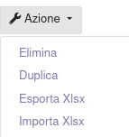
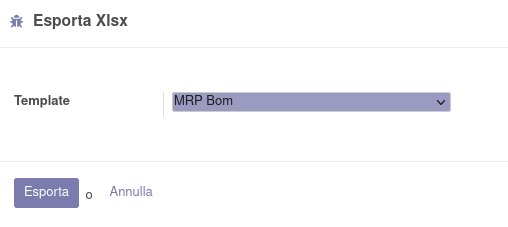
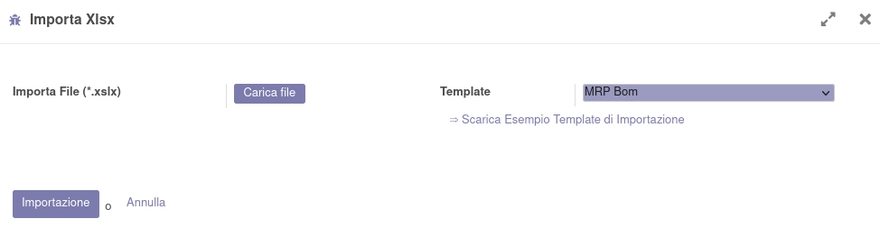
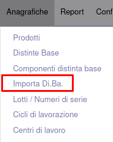

Nelle azioni della distinta base sono disponibili l'esportazione e l'importazione di Xlsx all'interno della distinta base stessa:

da cui la procedura di esportazione:

e quella di importazione:

In base al tracciato creato di default, che può essere sostituito con un altro di propria preferenza.
N.B.: il tracciato è configurato per aggiungere le righe a quelle esistenti, con l'opzione _NODEL_ all'inizio del nome del campo relativo alle righe.

Nel menu `Anagrafica` della produzione è inoltre disponibile una voce per creare una nuova Di.Ba.:

