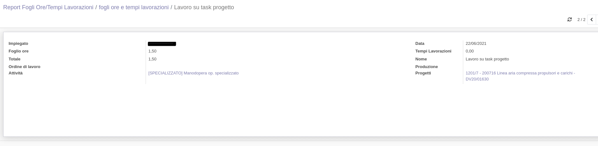

Nell'app Fogli Ore c'è il menu per accedere al report:

.. image:: ../static/description/menu.png
    :alt: Menu

che combina le ore lavorate nei task dei progetti con quelle negli ordini di
lavoro:

.. image:: ../static/description/report.png
    :alt: Report

È possibile entrare nel dettaglio delle ore riportate e verificare l'origine:
ordine di lavoro, produzione, attività e progetto:

