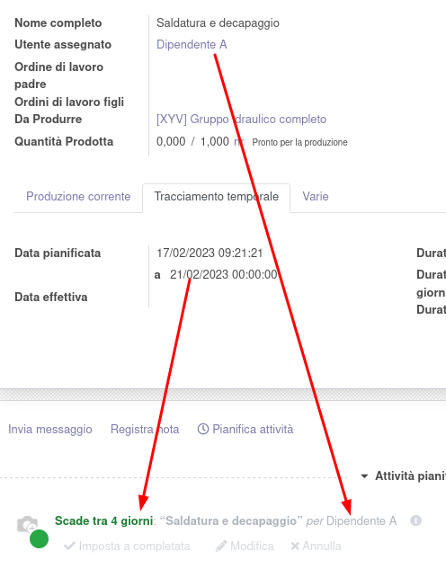

Questo modulo crea in automatico un'attività per ogni lavoro di progetto e operazione di produzione, distinta dalle altre attività tramite un flag apposito inserito nel tipo di attività:

L'attività creata viene aggiornata in base alle modifiche sull'oggetto da cui origina, allineando il nome, l'utente assegnato, l'oggetto padre, la data di inizio e di fine e la data di scadenza (pari alla data di fine attività):

Nel caso in cui l'attività venga modificata per quanto riguarda nome, utente assegnato, oggetto padre e date di inizio e fine e data di scadenza, viene aggiornato l'oggetto da cui origina.

È stato aggiunto un menu per accedere alle attività di questo tipo, in cui è disponibile la visualizzazione timeline ed è raggruppata di default per utente assegnato:

È possibile modificare l'utente assegnato e le date di attività trascinando l'oggetto a video nella timeline:

Il colore del testo nella timeline cambia in base allo sfondo, come da indicazioni html:

Dopo aver selezionato un'attività, è disponibile un tasto info su cui è sufficiente passare con il mouse per vedere informazioni dettagliate dell'attività:

