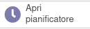

Questo modulo crea in automatico un'attività per ogni lavoro di progetto o operazione di produzione solo se creato direttamente dall'utente (quindi sono esclusi quelli creati automaticamente).
Questa attività è distinta dalle altre attività tramite un flag apposito inserito nel tipo di attività:

.. image:: ../static/description/abilita.png
    :alt: Abilita

L'attività creata viene aggiornata in base alle modifiche sull'oggetto da cui origina, allineando il nome, l'utente assegnato, l'oggetto padre, la data di inizio e di fine e la data di scadenza (pari alla data di fine attività), qui degli esempi basate sugli ordini di lavoro in produzione:

.. image:: ../static/description/attivita.png
    :alt: Attività

.. image:: ../static/description/attivita_modificata.png
    :alt: Attività sincronizzata

Mentre questi sono i campi su cui si basano le date di inizio e fine attività sui lavori di progetto:

Nel caso in cui l'attività venga modificata per quanto riguarda nome, utente assegnato, oggetto padre e date di inizio e fine e data di scadenza, viene aggiornato l'oggetto da cui origina.

È stato aggiunto un menu per accedere alle attività di questo tipo, in cui è disponibile la visualizzazione timeline ed è raggruppata di default per utente assegnato:

.. image:: ../static/description/menu.png
    :alt: Menu

È possibile modificare l'utente assegnato e le date di attività trascinando l'oggetto a video nella timeline:

.. image:: ../static/description/timeline.png
    :alt: Timeline

Se l'attività ha una data e ora di inizio e una data e ora di fine, è possibile allungarla/accorciarla, selezionandola prima e poi avvicinando il cursore all'inizio o alla fine dell'attività a video:

Il colore del testo nella timeline cambia in base allo sfondo, come da indicazioni html:

.. image:: ../static/description/colore_testo.png
    :alt: Colore testo

Dopo aver selezionato un'attività, è disponibile un tasto info su cui è sufficiente passare con il mouse per vedere informazioni dettagliate dell'attività:

.. image:: ../static/description/info_attivita.png
    :alt: Info attività

Nella produzione è disponibile una scheda in cui sono visibili le attività collegate agli ordini di lavoro:

Sempre nella produzione è possibile aprire direttamente la vista delle attività (non filtrate per la produzione attiva):

