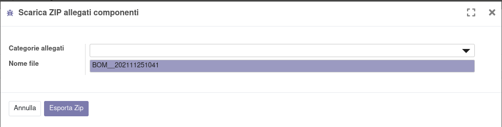

Questo modulo aggiunge un'azione per esportare gli allegati dei componenti (prodotto e relativo template) della bom dalla produzione o dalla bom:

.. image:: ../static/description/azione.png
    :alt: Azione

Che apre una finestra in cui si può modificare il nome del file che verrà creato:

Sarà quindi possibile scaricare il file:

