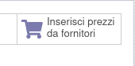

Quanto si inseriscono le righe delle distinte base, vengono automaticamente inseriti i costi dei prodotti.
Questi possono essere sovrascritti dall'utente, per adattarli in base alla propria convenienza.

.. image:: ../static/description/bom_evaluate.gif
    :alt: Valutazione bom

È inoltre disponibile un bottone che carica il prezzo migliore del fornitore:

