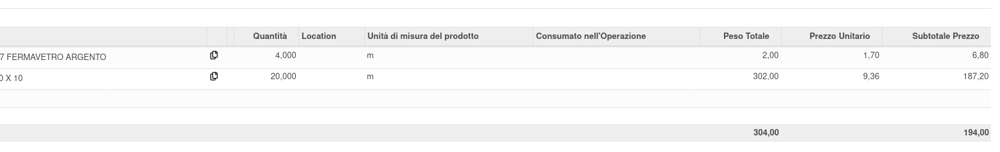

Quanto si inseriscono le righe delle distinte base, vengono automaticamente inseriti i costi dei prodotti con la data dell'ordine fornitore da cui sono rilevati. Viene preso l'ordine non in stato annullato più recente con prezzo diverso da zero.
Questi possono essere sovrascritti dall'utente, per adattarli in base alla propria convenienza.

.. image:: ../static/description/bom_evaluate.gif
    :alt: Valutazione bom

È disponibile un bottone che collega le righe ad un ordine a fornitore, quando sono presenti dei prodotti corrispondenti:

È possibile aggiornare il costo di sostituzione gestito del prodotto finale con i costi dei materiali e delle operazioni previste:

.. image:: ../static/description/operazioni.png
    :alt: Costi operazioni

Nel prodotto sarà quindi visibile, dopo il costo normale - aggiornato eventualmente sulla distinta base standard - il costo di sostituzione (denominato 'gestito' per distinguerlo dal costo di sostituzione di un modulo OCA):

.. image:: ../static/description/prodotto.png
    :alt: Costo prodotto finale

tramite il bottone:

A fine distinta sono visibili i totali di peso del grezzo e totale (se presenti finiture), del prezzo medio per kg e del prezzo totale.

I prodotti di tipo servizio presenti nella distinta base verranno inseriti nell'ordine di vendita quando confermato (e rimossi se annullato). Gli stessi genereranno quindi dei task e/o il progetto se mancante, in base alla loro configurazione.

Nei prodotti è stato aggiunto un flag 'Escludi Dalla Produzione' che, se selezionato, comporta che il prodotto, anche se presente nella distinta base, non sarà riportato nell'ordine di produzione. Questo caso è stato previsto per i materiali consumabili da utilizzare nel cantiere, che non verranno quindi utilizzati nella produzione, ma indicati nei prodotti consumati nei task del progetto.

Si può stampare il preventivo di costo della bom:

Report:

