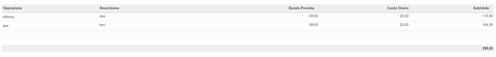

Quanto si inseriscono le righe delle distinte base, vengono automaticamente inseriti i costi dei prodotti.
Questi possono essere sovrascritti dall'utente, per adattarli in base alla propria convenienza.

È inoltre disponibile un bottone che carica il prezzo migliore del fornitore:

.. image:: ../static/description/prezzi_fornitori.png
    :alt: Inserimento prezzi fornitori

È inoltre possibile aggiornare il costo del prodotto finale con i costi dei materiali e delle operazioni previste:

.. image:: ../static/description/materiali.png
    :alt: Costi materiali

.. image:: ../static/description/prodotto.png
    :alt: Costo prodotto finale
