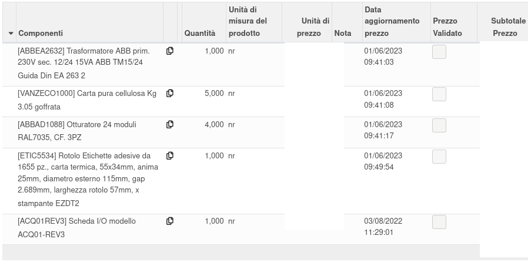
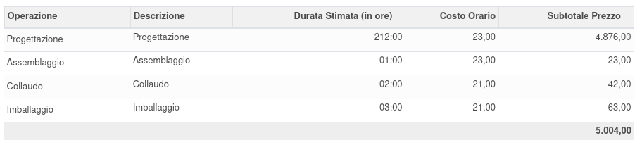
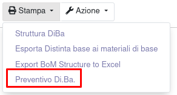
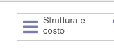
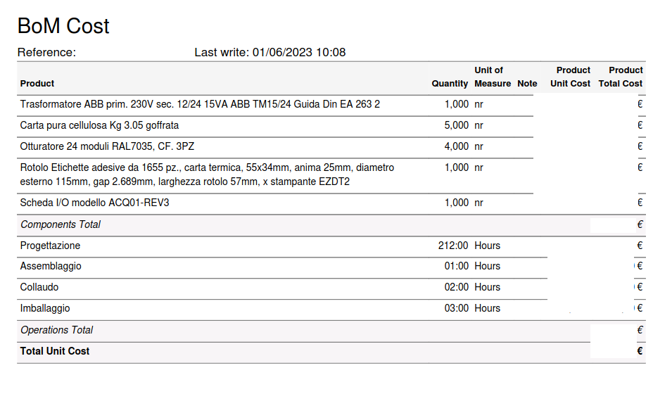

È stato aggiunto un nuovo menu in cui inserire delle distinte base che non sono visibili
Quanto si inseriscono le righe delle distinte base, vengono automaticamente inseriti i costi dei prodotti con la data del costo.
A fine distinta sono visibili i totali di costo per componenti, operazioni e complessivo.

Si può stampare il preventivo di costo della bom:

(anche dal bottone):

Report:

