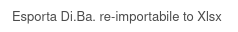
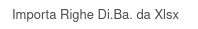

Questo modulo aggiunge un report per esportare le righe della Di.Ba. e un'azione per reimportarle. L'esportazione avviene dal menu Stampa:

mentre l'importazione dal menu Azione:

L'importazione sostituisce le righe Di.Ba. eventualmente presenti sulla Di.Ba. corrente.
