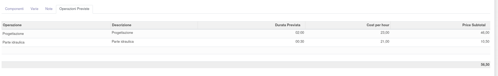

È possibile inserire i tempi previsti per la corrente distinta base, indifferentemente da quanto indicato nel routing selezionato:

I tempi indicati verranno riportati come tempo previsto nei relativi ordini di lavoro creati. Non è possibile inserire più operazioni collegate alla stessa operazione nel ciclo di lavorazione.