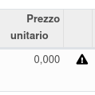

Nel prodotto è disponibile un campo per impostare il calcolo del prezzo tramite il listino, sulla base dei prezzi dei componenti valutati per categoria di listino (collegata alla categoria prodotto) secondo le regole del listino per costo bom per valore raggruppato (vedi README https://github.com/sergiocorato/e-efatto/blob/12.0/product_pricelist_bom_cost/README.rst del modulo padre):

Nel caso un prodotto abbia un prezzo dipendente da DiBa e non sia stato calcolato, viene mostrata un'icona di avvertimento:

