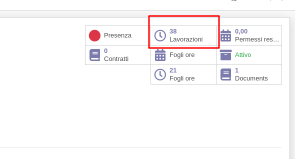
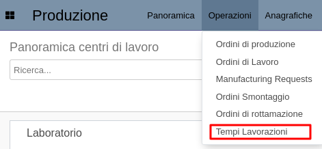
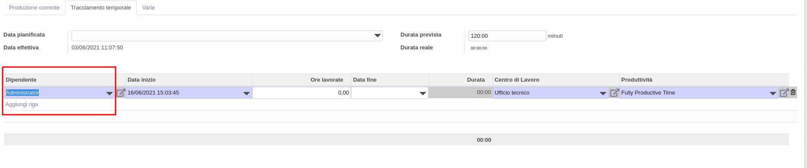

All'interno della maschera del dipendenti è visibile questo bottone

da cui si accede in maniera diretta alle lavorazioni eseguite dal dipendente.

Inoltre nell'app produzione si possono visualizzare tutte le lavorazioni
registrate da questo menu:

Nella registrazione sull'ordine di lavoro si avrà quindi a disposizione il
campo dipendente da compilare:

