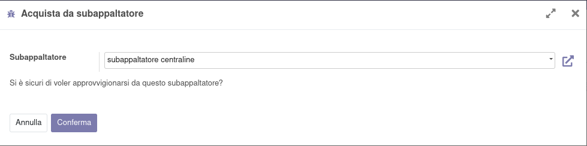
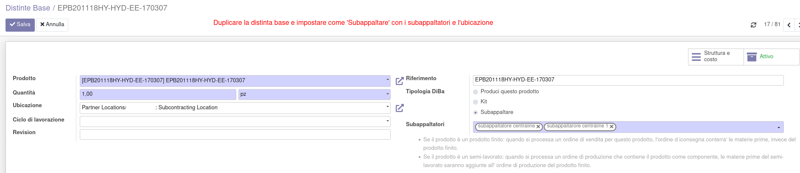
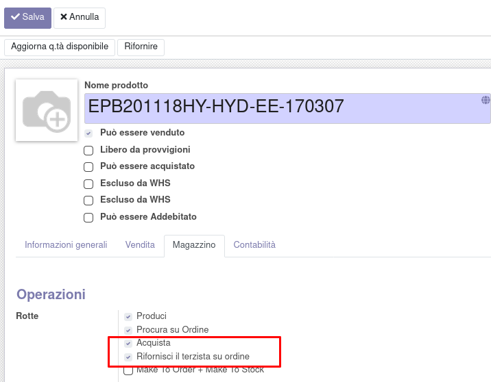
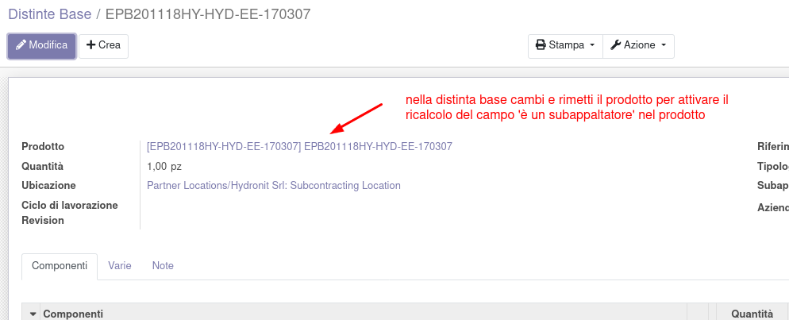
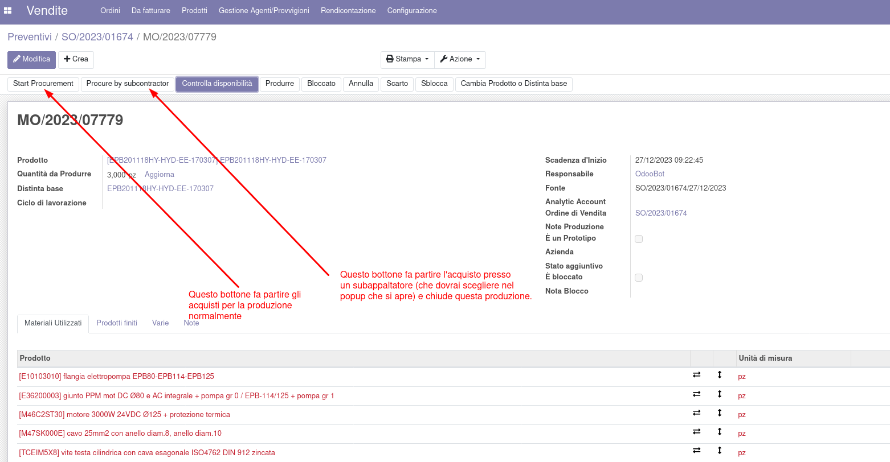
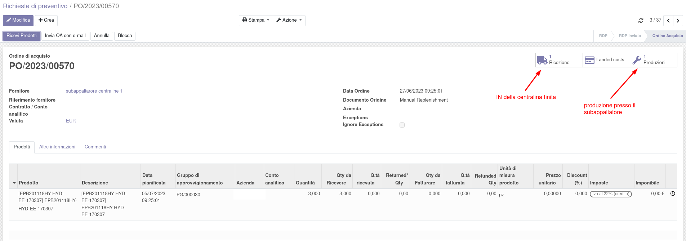
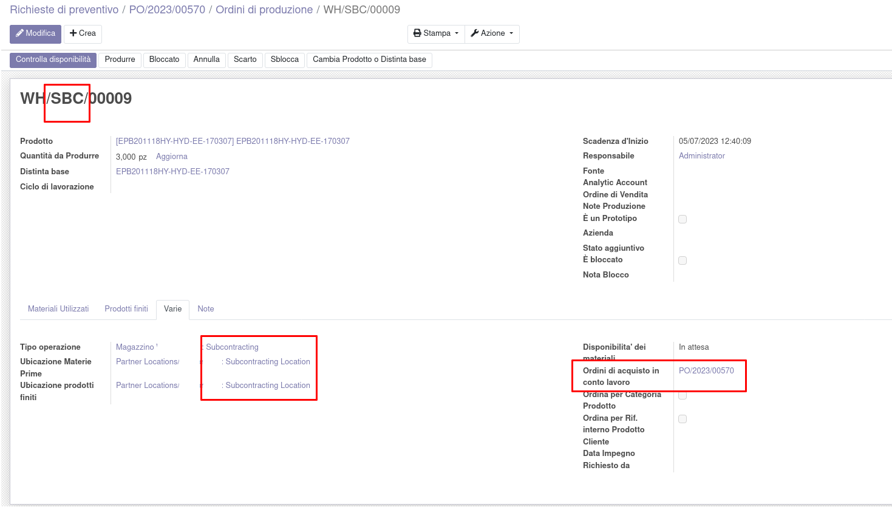

Questo modulo permette di scegliere se continuare la produzione creata per un prodotto oppure rifornirlo presso un subappaltatore.
Il prodotto richiesto deve avere sia il percorso di produzione che quello di acquisto, con una distinta base di produzione e una di subappalto.
Alla creazione della produzione di un prodotto che ha queste caratteristiche non vengono più avviati gli approvvigionamenti dei componenti.

Vengono quindi resi visibili due bottoni, che permettono, in alternativa, di proseguire con la produzione o di fermare la produzione e avviare l'acquisto presso un subappaltatore a scelta.

Il primo bottone permette di proseguire normalmente la produzione:

Il secondo bottone permette di scegliere un subappaltatore a cui ordinare il prodotto, chiudendo contemporaneamente questa produzione:

Si apre quindi una procedura che permette di scegliere tra i possibili subappaltatori. Alla conferma, la presente produzione sarà chiusa e sarà generato un ordine d'acquisto e una produzione verso il subappaltatore selezionato.

Nel caso ci siano prodotti subappaltati presso un singolo subappaltore, l'ordine di acquisto generato viene automaticamente confermato, sia che sia generato dalla rotta `Procura su Ordine` che da una regola di riordino.

La tipica procedura da seguire per modificare un prodotto da produrre internamente ad un prodotto che può avere entrambe le opzioni è:

.. image:: ../static/description/3_aggiungere_acquistabile.png
    :alt: 3_aggiungere_acquistabile

