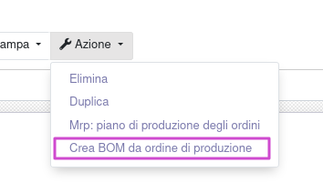
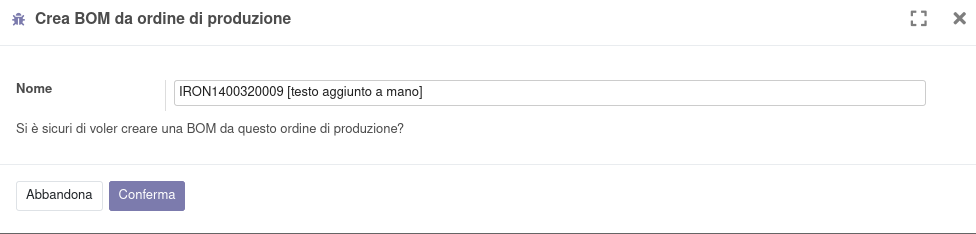

Questo modulo aggiunge un'azione nell'ordine di produzione

che apre una procedura che crea una BOM con gli articoli utilizzati nella produzione stessa. Le quantità verranno parametrate a 1.

Le righe con quantità utilizzata pari a zero verranno ignorate.
