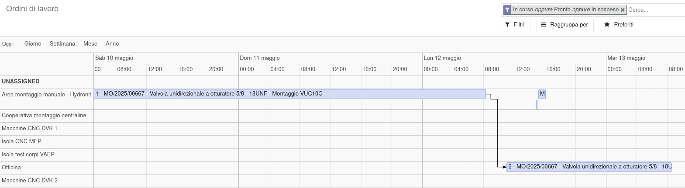
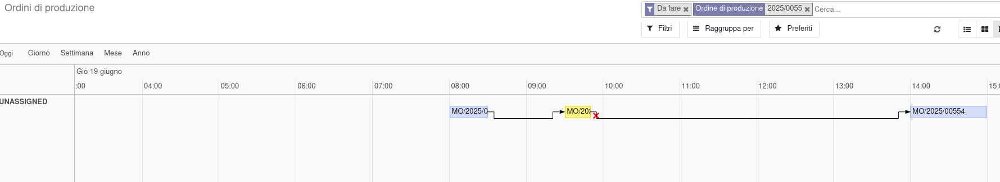

Questo modulo aggiunge la vista timeline e il collegamento tra gli ordini di lavoro padri e quelli figli con una freccia visibile a video:

Aggiunge il campo data pianificata finale sulla produzione, calcolata dalla massima data pianificata finale sugli ordini di lavoro. Se non sono stati pianificati gli ordini di lavoro, la data finale non è impostata.

