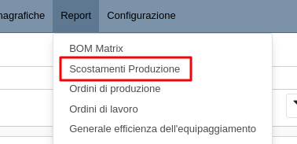
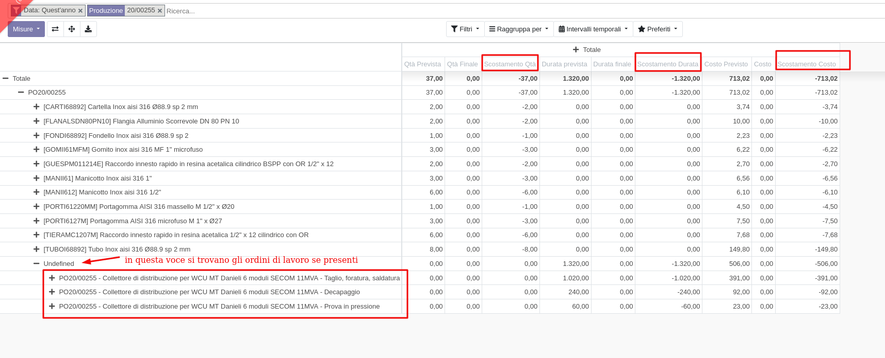

Questo modulo permette di visualizzare i dati relativi alle ore previste e quelle effettive (con i costi previsti ed effettivi) degli ordini di lavoro, con le quantità previste nelle distinte base e quelle effettive nell'ordine di produzione (e i corrispondenti costi previsti ed effettivi) in un'unica statistica.

Nella produzione è disponibile questo menu:

da cui è possibile visualizzare dati riassuntivi relativi ai tempi, materiali
e costi degli ordini di produzione:

I costi dei tempi lavorati sono valorizzati al costo del centro di lavoro collegato.

I costi dei materiali sono valorizzati al costo registrato nel movimento di magazzino di scarico.

1. prende i costi di acquisto al momento in cui viene consolidata la produzione
   Come aggiorno i costi se li conosco dopo che è stata consolidata?
   Gli articoli che vedi sottolineati, l'IRON su tutti, sono stati acquistati dopo la conferma della produzione e abbiamo conosciuto il costo solo dalla fattura...
   Il bottone aggiorna il costo sul movimento in ingresso pensandoci, questo è il costo sul movimento di scarico

2 cose sarebbero utili: 1. poter sistemare questi costi, 2. visualizzare in rosso che ci sono zeri, altrimenti possono sfuggire falsando i totali

per risolvere potrei:
BOCCIATO A. creare un cron che vada a prendere le righe dei componenti delle produzioni (con costo 0 - in alternativa tutte) e aggiornarle con l'ultimo costo di acquisto - in alternativa fare un calcolo di quale era il costo dell'articolo consumato (ad es. un articolo era già in magazzino ma è stato acquistato nel frattempo);
APPROVATO B. creare un wizard lanciabile da ogni singola produzione che fa le stesse cose sopra, in questo caso si potrebbe anche esporre all'utente una tabella in cui vedere le differenze e altre info specifiche

1. avere il costo di produzione con i costi in data della produzione (per costificare una commessa anche dopo vari acquisti della materia prima)
2. averlo con i costi aggiornati alla data della stampa del report (per valutare il costo di un prodotto che magari produco poco prima di fare una quotazione di vendita)

Imposto come lo voglio prima di stamparlo

3. stamparlo direttamente dall'ordine di produzione => farlo aprire dalla produzione filtrata per quella produzione specifica

BOCCIATO quindi diresti di mettere il tutto nello stesso wizard? (modifica/ricalcola prezzi e poi apri il report?): Non credo che il report sia il punto giusto per fare modifiche ai costi nel DB in modo permanente, da dove fare l'aggiornamento di questi campi lo lascerei decidere ad Alberico/Manuel.

Il report prende i costi dal movimento di magazzino per quanto riguarda i trasferimenti, a questo punto
DA FARE: si potrebbero aggiungere delle colonne con dei costi diversi, ad es. una colonna calcolata con il costo prodotto e una con il costo di sostituzione (qui dipende da come andrete a gestire i costi, se il costo prodotto sarà sempre il costo ultimo allora basta questo)
DA FARE se ci sono valori a zero direi di evidenziarli, come suggerito la settimana scorsa.

Oggi devo, 1. Andare nel DV, 2. passare dalla riga del DV al prodotto, 3. passare alla produzione, 4. aprire un tab e 5. andare nel report per 6. cercare il codice produzione che mi serve analizzare

DA FARE: Se quando mi trovo nel punto 3. potessi stampare il report per quella produzione eviterei di fare altri passaggi
