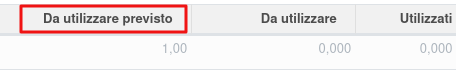

Questo modulo aggiunge un campo che conserva il dato 'Da utilizzare' in modo che, anche se non utilizzato, sia possibile valutare le previsioni di utilizzo iniziali.

Questo in quanto di default se una riga viene impostato come quantità utilizzata pari a 0, in automatico la quantità da utilizzare viene allineata (al netto di eventuali moduli extra che permettano di modificare la quantità da utilizzare stessa).
