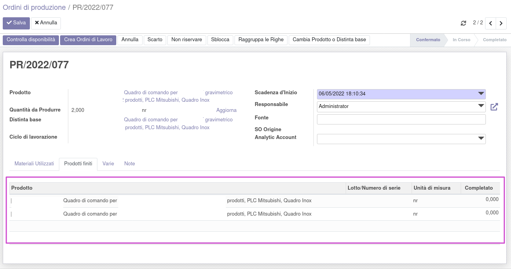

Questo modulo forza la creazione delle righe dei prodotti finiti alla creazione della produzione:

In questo modo, sbloccando la produzione, è possibile già assegnare i lotti/seriali, che verranno imputati in automatico negli ordini di lavorazione (se non inseriti manualmente).
