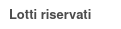

Questo modulo aggiunge un campo in cui indicare quali numeri di lotto
seriali sono riservati per una produzione. Tali numeri di lotto non
saranno utilizzabili in altre produzioni.

Inoltre questo modulo blocca la creazione di lotti univoci con lo stesso
nome della sequenza standard dell'azienda anche se per prodotti diversi.
Non ne blocca la creazione per nomi diversi (ricevuti quindi
dall'esterno).
