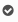

Non è necessaria alcuna configurazione.

Nella produzione è stata aggiunta un'icona che mostra le righe dei componenti completamente riservate:

Mentre lo stato di disponibilità materiali è `Pronto` solo quando tutte le righe dei componenti (eccetto i consumabili) sono prenotate (e non solo disponibili a magazzino, ma non prenotate per il movimento specifico).
