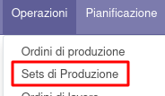

Questo modulo crea un oggetto Set di produzioni per collegare due produzioni (oppure la stessa produzione vista come due) per inviarle in maniera coordinata ad una macchina operatrice. La produzione di sinistra sarà inviata al centro di lavoro che è impostato come "sinistro" mentre quella di destra come "destro".
È anche possibile inviare solo la produzione di sinistra o la produzione di destra.

Dal menu si crea un nuovo record:

in cui è possibile selezionare 2 distinte produzioni:

oppure 1 produzione e impostare il chech su "Suddividere la produzione" (in questo caso la produzione occuperà entrambi i centri di lavoro):

oppure inviare la sola produzione destra o la sola produzione sinistra.

Se una delle produzioni selezionate è in stato "Bozza", è visibile il bottone "Conferma" per confermarle:

Si può quindi procedere ad impostare la quantità da produrre delle singole produzioni selezionate:

aggiornando la quantità nelle produzioni con il tasto "Aggiorna Q.tà in Produzione":

È necessario quindi pianificare il set di produzioni, che andrà a impostare la data di avvio sugli ordini di lavoro delle produzioni collegate, verificando che siano correttamente impostati rispettivamente sul lato sinistro e sul lato destro. Se è una produzione splittata, la lavorazione verrà suddivisa su entrambi i centri di lavoro.

.. image:: ../static/description/pianifica.png
    :alt: Pianifica

È eventualmente possibile annullare la pianificazione e ripianificarla.

.. image:: ../static/description/annulla_pianificazione.png
    :alt: Annulla la pianificazione

Si può infine inviare le produzioni al macchinario tramite il bottone aggiunto dal connettore installato (attualmente l'unico modulo esistente aggiunge il bottone sotto):

.. image:: ../static/description/invia.png
    :alt: Invia
