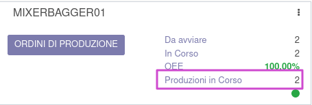

Il modulo aggiunge un blocco per l'avvio di produzioni oltre la capacità del workcenter.

Nel workcenter è possibile aprire le produzioni in corso relative al workcenter da questo bottone:

mentre nel kanban è aggiunta una riga che esegue la stessa azione:

