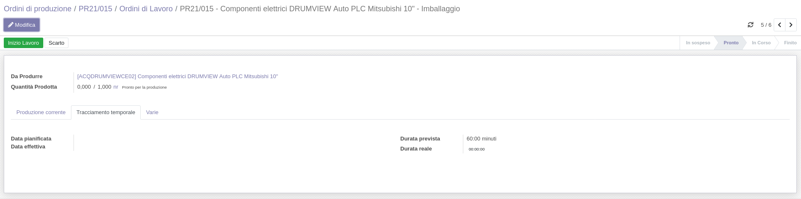
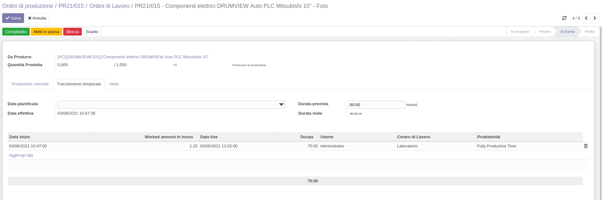

Negli ordini di lavoro di default viene registrato il tempo dall'avvio alla
fine tramite i bottoni di avvio/fine del lavoro.

In caso di registrazioni non automatizzate, è comodo inserire le ore lavorate
a partire da una data/ora di inizio. Questo modulo inserisce un campo in cui
indicare le ore di lavoro in maniera decimale (1,25 = 1:15).
Quando viene usato il campo, la data di avvio viene troncata al minuto (es.
15/06/2021 11:05:22 = 15/06/2021 11:05:00) per semplicità.

Per registrare i tempi è necessario avviare il lavoro con il bottone qui:

Per poi entrare in Modifica e indicare nel campo 'Ore lavorate' le ore:

