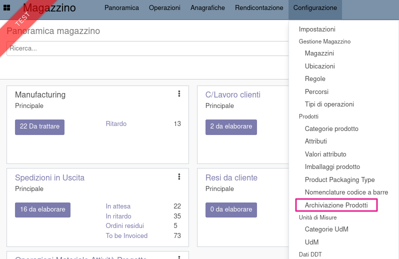
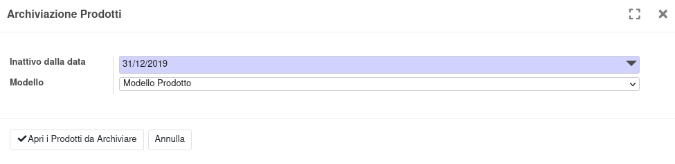
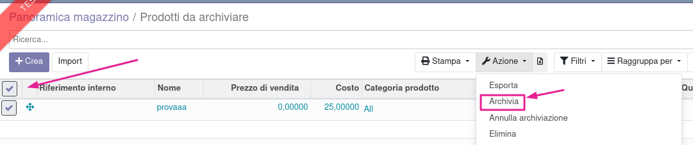

Nella configurazione del magazzino è disponibile una procedura per selezionare i prodotti non movimentati da una data indicata:

Nella finestra che si apre va indicata la data fino alla quale verranno selezionati i prodotti non movimentati, con le seguenti caratteristiche:

#. Nessuna movimentazione dopo la data indicata
#. Nessuna disponibilità
#. Nessun ingresso previsto
#. Nessuna uscita prevista
#. Nessuna riserva
#. Data creazione antecedente la data indicata
#. Data ultima modifica antecedente la data indicata

Nella finestra è possibile selezionare i modelli di prodotto:

oppure le varianti di prodotto:

.. image:: ../static/description/selezione_varianti.png
    :alt: Selezione varianti

Verrà alla fine aperta una maschera con i prodotti filtrati, che sarà possibile archiviare con l'azione archivia:

