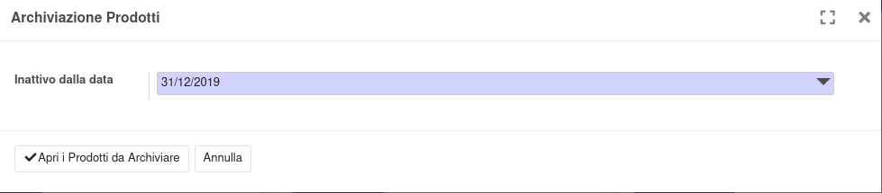

Nella configurazione del magazzino è disponibile una procedura per selezionare i prodotti non movimentati da una data indicata:

.. image:: ../static/description/menu.png
    :alt: Menu archivia

Nella finestra che si apre va indicata la data fino alla quale verranno selezionati i prodotti non movimentati, con le seguenti caratteristiche:

#. Nessuna movimentazione dopo la data indicata
#. Nessuna disponibilità
#. Nessun ingresso previsto
#. Nessuna uscita prevista
#. Nessuna riserva

Verrà alla fine aperta una maschera con i prodotti filtrati, che sarà possibile archiviare con l'azione archivia:

.. image:: ../static/description/archivia.png
    :alt: Archivia
