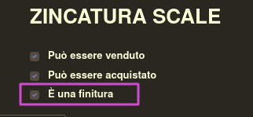

Nelle categorie prodotto è presente un campo in cui indicare le finiture applicabili ai prodotti di questa categoria, in cui sono selezionabili solo i prodotti con il campo 'È una finitura' selezionato:

Nei prodotti è presente un campo in cui indicare che è una finitura:

