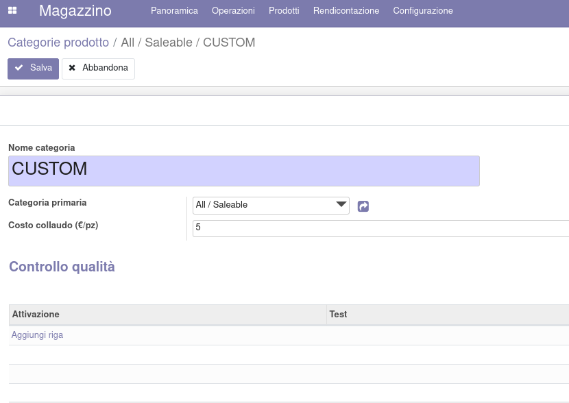
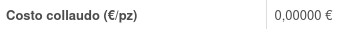
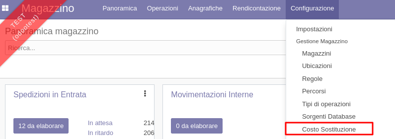
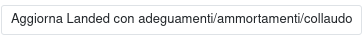
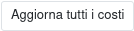
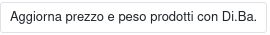
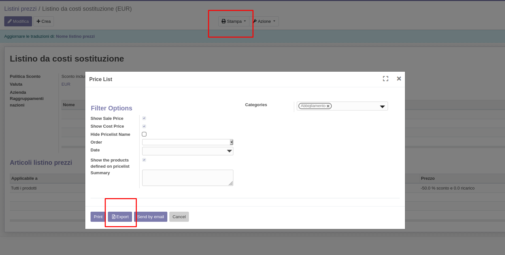

È possibile calcolare un costo di sostituzione del prodotto con dei supplementi calcolati in maniera automatica.

Per i prodotti che hanno un fornitore impostato nel tab Acquisti e non hanno una distinta di produzione, se nel prodotto è impostata la Nomenclatura Combinata, si può:
 #. Creare una Tariffa Doganale con la % del costo della tariffa
 #. Impostare nella Nomenclatura Combinata una Tariffa Doganale

Inoltre se la nazione del fornitore è in un gruppo di nazioni, si può:
 #. Inserire nel gruppo di nazioni una % di costo per logistica

I prodotti che hanno una distinta di produzione verranno ricalcolati sulla base del costo di sostituzione ricalcolato sopra.

La formula applicata è:
 #. costo del primo fornitore nel tab acquisti del prodotto convertito in € dalla valuta del fornitore al tasso più recente disponibile => Costo Diretto
 #. somma il totale delle maggiorazioni per: Maggiorazione cambio (indicato nella valuta del fornitore), Margine di logistica (indicato nel gruppo di paesi del fornitore) e Tariffa dazio doganale (indicato nel codice doganale prodotto) e le aggiunge al Costo Diretto (se è un fornitore extra europeo e se il Tipo intrastat del prodotto è indicato) => Landed senza ammortamenti/collaudo
 #. somma il Costo Collaudo (€/pz) e il Costo Ammortamento (€/pz) al Landed senza ammortamenti/collaudo => Landed con Ammortamento e Collaudo
 #. somma il Costo Adeguamento (€/pz) al Landed con Ammortamento e Collaudo => Landed con Ammortamento, Collaudo e Adeguamento

È possibile impostare il costo collaudo nella categoria del prodotto, oppure direttamente nel prodotto nel caso serva un valore specifico per quel prodotto. Il costo collaudo nel prodotto prevale su quello impostato nella categoria, è sufficiente impostarlo a 0 per far riprendere al prodotto il costo collaudo della categoria.

I prodotti che non hanno né fornitori né una distinta di produzione non verranno modificati.

Questo calcolo è possibile farlo in maniera indipendente dal menu:

tramite quattro azioni: la prima esegue l'aggiornamento del *Landed con adeguamenti/ammortamenti/collaudo* solamente:

la seconda esegue l'aggiornamento di 3 campi: *Costo diretto*, *Landed senza ammortamenti/collaudo* e *Landed con ammortamenti/collaudo*:

la terza esegue l'aggiornamento di tutti i costi:

La quarta esegue l'aggiornamento del prezzo di vendita e del peso dei prodotti con distinta base, calcolando i valori solo sulla distinta base direttamente collegata al prodotto (senza quindi ricorsività). Se si desidera aggiornare i valori delle distinte figlie prima di aggiornare questo valore, assicurarsi di avviare un aggiornamento con i metodi precedenti e poi di avviare questo aggiornamento su tutte le distinte base. Per come è stato richiesto questo metodo, non assicura comunque un aggiornamento ricorsivo completo.

Nota bene: non è possibile ripristinare nessuna di queste operazioni, in quanto vanno a sovrascrivere i campi citati. Tenere conto inoltre che i campi del prezzo di vendita e del costo landed senza adeguamento/ammortamento (costo standard rinominato) potrebbero essere modificati in maniera automatica dal sistema in base alla configurazione.

In seguito è utile creare un listino a partire dal costo per generare un'esportazione (reimportabile) per effettuare un cambio di listino di vendita programmato:

