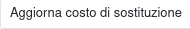

È possibile calcolare un costo di sostituzione del prodotto con dei supplementi
calcolati in maniera automatica.

I prodotti che hanno un fornitore impostato nel tab Acquisti e non hanno
una distinta di produzione:

- se nel prodotto è impostata la Nomenclatura Combinata, si può:
  - Creare una Tariffa Doganale con la % del costo della tariffa
  - Impostare nella Nomenclatura Combinata una Tariffa Doganale

- se la nazione del fornitore è in un gruppo di nazioni, si può:
  - Inserire nel gruppo di nazioni una % di costo per logistica

I prodotti che hanno una distinta di produzione verranno ricalcolati sulla base
del costo di sostituzione ricalcolato sopra.

I prodotti che non hanno né fornitori né una distinta di produzione non
verranno modificati.

Questo calcolo è possibile farlo in maniera indipendente dal menu:

tramite due azioni

1. questa azione esegue l'aggiornamento del costo di sostituzione solamente;

2. questa azione esegue l'aggiornamento del punto 1. e poi riporta lo stesso
   valore nel campo costo del prodotto. Non è possibile ripristinare questa
   operazione, per cui il campo costo da ora in poi sarà questo. Tenere conto
   in ogni caso che questo campo potrebbe essere modificato in maniera automa-
   tica dal sistema in base alla configurazione.

.. image:: ../static/description/aggiorna_costo.png
    :alt: Aggiorna il costo

In seguito è utile creare un listino a partire dal costo per generare un'espor-
tazione (reimportabile) per effettuare un cambio di listino di vendita program-
mato:

.. image:: ../static/description/listino.png
    :alt: Esporta un listino
