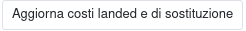

È possibile calcolare un costo di sostituzione del prodotto con dei supplementi calcolati in maniera automatica.

Per i prodotti che hanno un fornitore impostato nel tab Acquisti e non hanno una distinta di produzione, se nel prodotto è impostata la Nomenclatura Combinata, si può:
 #. Creare una Tariffa Doganale con la % del costo della tariffa
 #. Impostare nella Nomenclatura Combinata una Tariffa Doganale

Inoltre se la nazione del fornitore è in un gruppo di nazioni, si può:
 #. Inserire nel gruppo di nazioni una % di costo per logistica

I prodotti che hanno una distinta di produzione verranno ricalcolati sulla base del costo di sostituzione ricalcolato sopra.

La formula applicata è:
 #. costo del primo fornitore nel tab acquisti del prodotto convertito in € dalla valuta del fornitore al tasso più recente disponibile => Costo Diretto
 #. somma il totale delle maggiorazioni per: Maggiorazione cambio (indicato nella valuta del fornitore), Margine di logistica (indicato nel gruppo di paesi del fornitore) e Tariffa dazio doganale (indicato nel codice doganale prodotto) e le aggiunge al Costo Diretto (se è un fornitore extra europeo e se il Tipo intrastat del prodotto è indicato) => Costo Landed
 #. somma il Costo Collaudo (€/pz) e il Costo Ammortamento (€/pz) al Costo Landed => Costo Landed con Ammortamento e Collaudo
 #. somma il Costo Adeguamento (€/pz) al Costo Landed con Ammortamento e Collaudo => Costo Landed con Ammortamento, Collaudo e Adeguamento

È possibile impostare il costo collaudo nella categoria del prodotto, se impostato nel prodotto verrà automaticamente scritto sulla categoria del prodotto:

I prodotti che non hanno né fornitori né una distinta di produzione non verranno modificati.

Questo calcolo è possibile farlo in maniera indipendente dal menu:

.. image:: ../static/description/menu.png
    :alt: Menu in impostazioni Magazzino

tramite quattro azioni: la prima esegue l'aggiornamento del costo di sostituzione solamente:

.. image:: ../static/description/aggiorna_sostituzione.png
    :alt: Aggiorna il costo di sostituzione

la seconda esegue l'aggiornamento dei soli costi landed (con o senza costi di adeguamento/ammortamento):

la terza esegue l'aggiornamento dei costi landed (con o senza costi di adeguamento/ammortamento) e del costo di sostituzione:

La quarta esegue l'aggiornamento del prezzo di vendita dei prodotti con distinta base.

Nota bene: non è possibile ripristinare nessuna di queste operazioni, in quanto vanno a sovrascrivere i campi citati. Tenere conto inoltre che i campi del prezzo di vendita e del costo landed senza adeguamento/ammortamento (costo standard rinominato) potrebbero essere modificati in maniera automatica dal sistema in base alla configurazione.

In seguito è utile creare un listino a partire dal costo per generare un'esportazione (reimportabile) per effettuare un cambio di listino di vendita programmato:

.. image:: ../static/description/listino.png
    :alt: Esporta un listino
