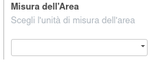

Nel prodotto è stato aggiunto il campo unità di misura Area con scelta dell'unità di misura:

.. image:: ../static/description/prodotto.png
    :alt: Prodotto

Dalla configurazione generale è possibile scegliere l'unità di misura di default per l'area:

