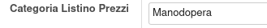
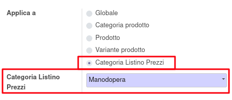
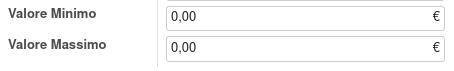

Nelle categorie prodotto è stato aggiunto un campo per definire la categoria di listino prezzi applicabile:

Nel listino prezzi è quindi possibile creare delle regole con queste categorie di listino prezzi:

Nel prodotto, se è installato il modulo https://github.com/sergiocorato/e-efatto/tree/12.0/mrp_bom_sale_pricelist, è disponibile un'opzione 'Calcola prezzo da DiBa':

.. image:: ../static/description/vendita.png
    :alt: Vendita

Che se selezionata comporta che il prezzo di vendita venga valorizzato in base alle regole presenti nel listino, in base agli scaglioni di valore indicati. Sono stati aggiungi i campi: 'Valore minimo', 'Valore Massimo' sulle regole di listino per questo scopo:

N.B. I valori sono valutati sulla base del prezzo della singola distinta base, per cui gli scaglioni vengono raggiunti se i componenti della distinta base raggiungono lo scaglione. L'impostazione di una quantità superiore ad 1 nella riga dell'ordine di vendita non ha effetti sul prezzo unitario.
