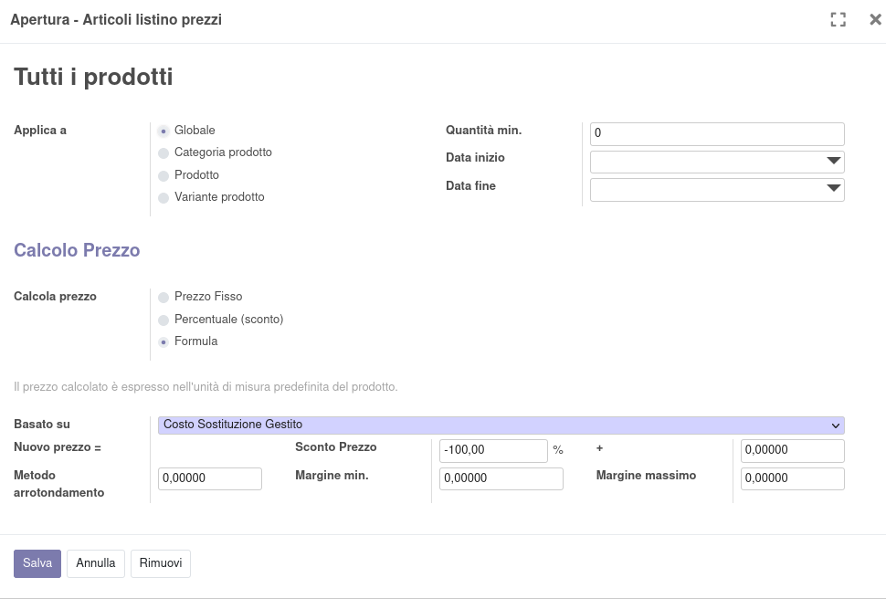
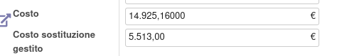
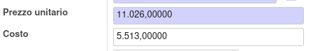

Nel listino prezzi impostare il tipo di costo su 'Costo sostituzione
gestito':

Quindi a partire da un prodotto con questa situazione di costi:

Il prezzo di vendita e il margine saranno calcolati sul costo
sostituzione gestito:

