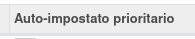

Nel fornitore del prodotto è stato aggiunto un campo che mostra se il fornitore è stato impostato come prioritario (minore sequenza) da questo modulo, bypassando quindi la normale funzionalità di Odoo:

Questo flag viene impostato automaticamente quando viene aggiunto un fornitore, in seguito viene rimosso automaticamente quando viene aggiunto un altro fornitore e così via.
