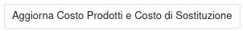

Questo modulo mette a disposizione delle funzionalità per verificare l'attendibilità dei prezzi di acquisto dei prodotti e per aggiornare il costo o il costo di sostituzione in base a questi prezzi.

Il costo (o il costo di sostituzione) possono venire calcolati tramite un listino prezzi collegato.

I prodotti vengono considerati solo se hanno un fornitore (TODO O UN'ULTIMA FATTURA O UN ULTIMO ACQUISTO) e sono acquistabili, la presenza o meno di una distinta di produzione non viene considerata (questo modulo non dipende dalla produzione).

Il nuovo costo viene calcolato tramite il listino collegato, che si può basare o meno sul prezzo del fornitore collegato (tramite l'utilizzo del modulo product_pricelist_supplierinfo).

Il menu creato dal modulo mette a disposizione quattro azioni:

.. image:: ../static/description/menu.png
    :alt: Menu in impostazioni Magazzino

La prima esegue il solo controllo dei prezzi:

.. image:: ../static/description/controllo.png
    :alt: Controllo prezzi

La seconda esegue l'aggiornamento del costo:

.. image:: ../static/description/aggiorna_costo.png
    :alt: Aggiorna il costo

La terza esegue l'aggiornamento del costo di sostituzione:

.. image:: ../static/description/aggiorna_sostituzione.png
    :alt: Aggiorna il costo di sostituzione

N.B.: Non è possibile ripristinare questa operazione, per cui il campo costo da ora in poi sarà questo. Tenere conto in ogni caso che questo campo potrebbe essere modificato in maniera automatica dal sistema in base alla configurazione.

La quarta esegue l'aggiornamento sia del costo che del costo di sostituzione:

N.B.: Nel caso sia installato il modulo https://github.com/sergiocorato/e-efatto/tree/12.0/product_pricelist_replenishment_cost è possibile impostare i listini di vendita sulla base del costo di sostituzione, su cui sarà calcolato il margine di vendita, senza andare a toccare il costo del prodotto.
