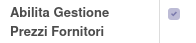
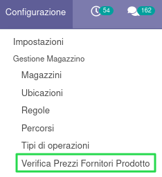
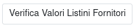
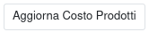
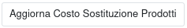
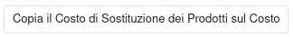

Questo modulo mette a disposizione delle funzionalità per verificare l'attendibilità dei prezzi di acquisto dei prodotti e per aggiornare il costo o il costo di sostituzione in base a questi prezzi.

Il menu creato dal modulo mette a disposizione quattro azioni:

La prima esegue il solo controllo dei prezzi:

La seconda esegue l'aggiornamento del costo:

La terza esegue l'aggiornamento del costo di sostituzione:

N.B.: Non è possibile ripristinare questa operazione, per cui il campo costo da ora in poi sarà questo. Tenere conto in ogni caso che questo campo potrebbe essere modificato in maniera automatica dal sistema in base alla configurazione.

La quarta copia il costo di sostituzione sul costo del prodotto:

N.B.: Nel caso sia installato il modulo https://github.com/sergiocorato/e-efatto/tree/12.0/product_pricelist_replenishment_cost è possibile impostare i listini di vendita sulla base del costo di sostituzione, su cui sarà calcolato il margine di vendita, senza andare a toccare il costo del prodotto.

Dettaglio del funzionamento
===========================

Premesse
~~~~~~~~

#. i prodotti vengono considerati solo se hanno un fornitore
#. i prodotti vengono considerati solo se sono acquistabili
#. la presenza o meno di una distinta di produzione non viene considerata
#. il nuovo costo/costo gestito viene calcolato tramite il listino collegato, in cui è possibile indicare solo la percentuale di sconto e arrotondamento

Processo di creazione del nuovo costo
~~~~~~~~~~~~~~~~~~~~~~~~~~~~~~~~~~~~~

#. viene cercato il primo fornitore con data di validità in corso e prezzo diverso da zero
#. se non viene trovato alcun fornitore:

  #. se il prodotto non ha né un ultimo acquisto né un'ultima fattura: il nuovo costo viene calcolato dal costo del prodotto con la regola del listino selezionato
  #. in caso contrario il processo termina e passa al prodotto successivo (l'ultimo costo d'acquisto o l'ultimo costo in fattura quindi non vengono utilizzati)
  #. (i prodotti con il nuovo costo pari a zero vengono mostrati in "Prodotti a costo calcolato zero senza acquisto né fattura")
  #. (i prodotti vengono mostrati in 'Prodotti senza fornitore')

#. se viene trovato almeno un fornitore valido con prezzo diverso da zero:

  #. viene selezionato solo il primo fornitore valido
  #. se è indicata la Data Obsolescenza Prezzi Fornitori, i prodotti con la data di ultima modifica del prezzo di questo fornitore precedente alla data indicata vengono mostrati nei 'Prodotti con prezzo fornitore obsoleto';
  #. se il prodotto ha un ultimo acquisto ed è più recente dell'ultimo prezzo fornitore:

    #. se l'ultimo fornitore è diverso dal fornitore valido, viene mostrato in 'Prodotti con fornitore non coincidente';
    #. se l'ultimo acquisto è uguale all'ultimo prezzo fornitore, il processo termina e passa al prodotto successivo
    #. se è diverso, viene calcolato il nuovo costo dal costo dell'ultimo acquisto con la regola del listino selezionato (se il nuovo costo è pari a zero il prodotto viene mostrato in "Prodotti a costo calcolato zero con acquisto")

  #. altrimenti, se il prodotto ha un'ultima fattura ed è più recente dell'ultimo prezzo fornitore:

    #. se l'ultima fattura è di un fornitore diverso dal fornitore valido, viene mostrato in 'Prodotti con fornitore non coincidente';
    #. se l'ultimo acquisto da fattura è uguale all'ultimo prezzo fornitore, il processo termina e passa al prodotto successivo
    #. se è diverso, viene calcolato il nuovo costo dal costo dell'ultima fattura con la regola del listino selezionato (se il nuovo costo è pari a zero il prodotto viene mostrato in "Prodotti a costo calcolato zero con fattura")

  #. altrimenti viene calcolato il nuovo costo dal costo del fornitore valido (se il nuovo costo è pari a zero il prodotto viene mostrato in "Prodotti a costo calcolato zero con acquisto o fattura più vecchi")
