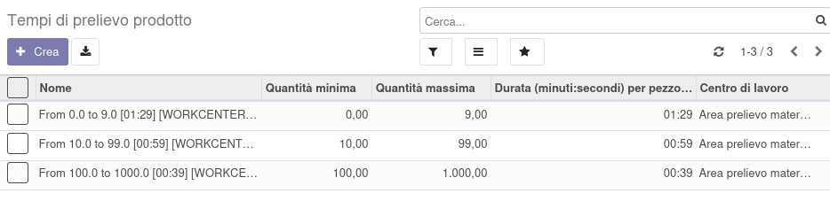

La lista dei tempi di prelievo dei prodotti per la produzione è
configurabile in questo menu:

Ecco un esempio di inserimento:

Nel prodotto si possono selezionare uno o più tempi, verrà bloccata
l'eventuale selezione di quantità sovrapposte:

Il costo del tempo di prelievo verrà quindi imputato alla produzione e
nella bom sulla base della quantità del componente presente nella
produzione, mentre nella DiBa sarà quello in relazione alla quantità
minima prevista.
