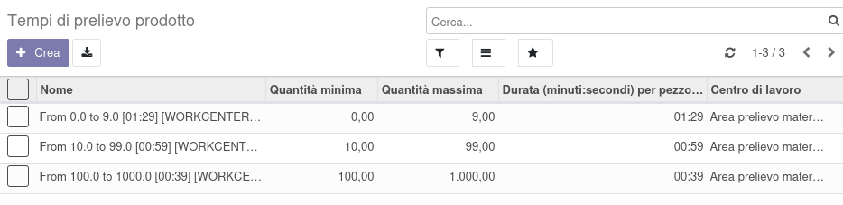

La lista dei tempi di prelievo dei prodotti per la produzione è configurabile in questo menu:

.. image:: ../static/description/menu.png
    :alt: Menu

Ecco un esempio di inserimento:

Nel prodotto si possono selezionare uno o più tempi, verrà bloccata l'eventuale selezione di quantità sovrapposte:

Il costo del tempo di prelievo verrà quindi imputato alla produzione e nella bom sulla base della quantità del componente presente nella produzione, mentre nella DiBa sarà quello in relazione alla quantità minima prevista.
