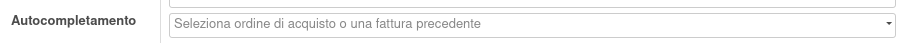
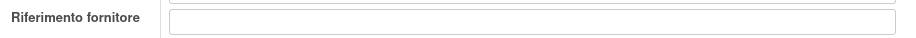

Non è necessaria alcuna configurazione.

Quando viene usato il campo autocompletamento per inserire degli ordini di acquisto nella fattura del fornitore:

il campo riferimento, usato per inserire il numero della fattura assegnato dal fornitore, resterà invariato:

