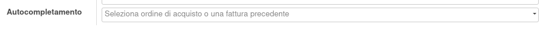

Non è necessaria alcuna configurazione.

Quando viene usato il campo autocompletamento per inserire degli ordini di acquisto nella fattura del fornitore:

verranno resi visibili solo gli ordini d'acquisto con righe da fatturare ed inserite nella fattura solo le righe con quantità da fatturare diversa da zero.
