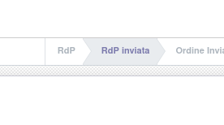
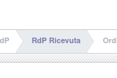

Questo modulo aggiunge gli stati 'RdP inviata' e 'RdP Ricevuta' dopo lo stato Bozza.

Alla stampa o all'invio via mail l'RdP passa in stato RdP inviata:

Alla pressione del bottone RdP Ricevuta passa in stato RdP ricevuta se è attivo lo stato extra Confermato degli ordini di acquisto, in caso contrario passa allo stato Ordine di Acquisto:

