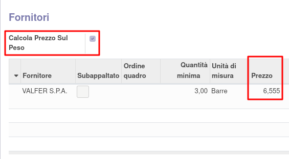
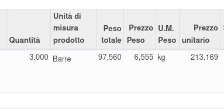

Questo modulo fornisce  una soluzione semplice per gestire i prodotti acquistati a peso ma che vengono gestiti internamente con una diversa unità di misura, senza appesantire la logica di gestione.

Sul prodotto (di tipo consumabile o stoccabile) che abbia un peso e un fornitore con un prezzo:

.. image:: ../static/description/peso.png
    :alt: Peso prodotto

.. image:: ../static/description/prezzo-fornitore-kg.png
    :alt: Fornitore

si può impostare il 'Calcola prezzo sul peso':

In questo modo, creando un ordine di acquisto con questo prodotto, il prezzo unitario sarà calcolato con la formula: prezzo fornitore * peso prodotto (con trasformazione in base all'u.m. di acquisto).

Nella riga dell'ordine di acquisto sono inoltre mostrati il 'Peso totale', il 'Prezzo Peso' e l'U.M. Peso' che riportano i valori del prodotto:

È possibile indicare un 'Prezzo Peso' diverso da quello proposto, in tal caso il prezzo unitario verrà ricalcolato (come pure il prezzo totale).
