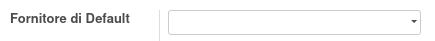
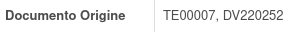

Questo modulo permette di raggruppare i bandi di gara sul fornitore di default del prodotto, che può essere indicato sul campo apposito, oppure lasciato alla scelta automatica del fornitore (in base ai moduli installati, può essere il primo valido oppure il migliore).

Il modulo aggiunge inoltre i seguenti campi aggiuntivi, compilati automaticamente dal sistema, alla riga del bando di gara:

 #. gruppo di approvvigionamento
 #. origine (non visibile a video)

.. image:: ../static/description/gruppo.png
    :alt: Gruppo

Inoltre aggiunge l'origine del bando di gara all'ordine di acquisto, oltre al già presente nome del bando di gara:

