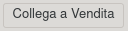
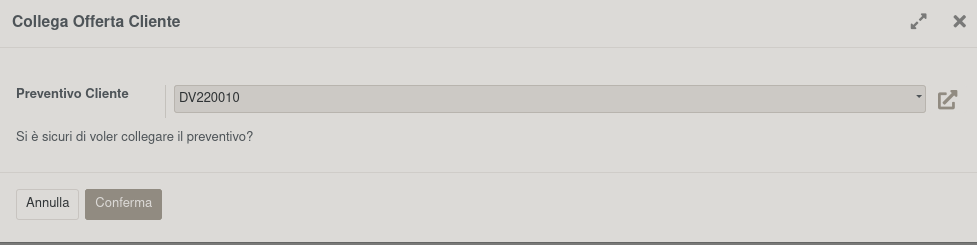
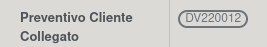

Collega un preventivo/ordine di vendita all'ordine di acquisto. La casistica è la creazione di RdP a fornitori prima della conferma del preventivo di vendita, per cui il processo è invertito rispetto al solito.

Cliccando sul bottone:

si apre un wizard che permette di selezionare l'ordine di vendita:

Verranno collegate le righe dell'ordine di vendita se sono presenti dei prodotti proposti in questa RdP, oppure le righe delle distinte basi dei prodotti se sono presenti dei componenti proposti in questa RdP.

Si vedranno quindi in questo campo:

