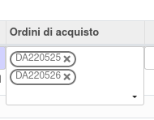
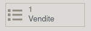

Questo modulo permett di collegare un ordine di acquisto ad una riga di un'opportunità, in modo da tener traccia delle RdP ricevute da fornitori prima della conferma del preventivo di vendita. Queste RdP saranno poi utilizzabili per inserire i prezzi di acquisto dei componenti delle distinte base dei prodotti venduti.

Nelle righe prodotti dei lead è stato aggiunto un campo in cui è possibile collegare le RdP/Ordini di Acquisto ricevuti per la riga.

Nell'ordine di acquisto è stato aggiunto il campo `Lead line` per collegarli direttamente dal documento:

.. image:: ../static/description/acquisto.png
    :alt: Acquisto

Nell'ordine di acquisto è presente un campo per vedere gli ordini di vendita collegati:

