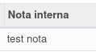
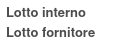
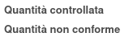

Nel prodotto o nel template si può indicare una nota:

che verrà riportata nella nota interna dell'ispezione:

Lo stesso si può fare per altri due campi aggiuntivi a solo scopo
informativo: lotto interno e lotto fornitore:

Sono stati infine aggiunti altri due campi, sempre a scopo informativo:
quantità controllata e quantità non conforme:

