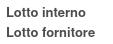
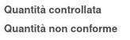

Nel prodotto o nel template si può indicare una nota:

.. image:: ../static/description/nota.png
    :alt: Nota sul prodotto

che verrà riportata nella nota interna dell'ispezione:

.. image:: ../static/description/nota_interna.png
    :alt: Nota interna sull'ispezione

Lo stesso si può fare per altri due campi aggiuntivi a solo scopo informativo: lotto interno e lotto fornitore:

Sono stati infine aggiunti altri due campi, sempre a scopo informativo: quantità controllata e quantità non conforme:

